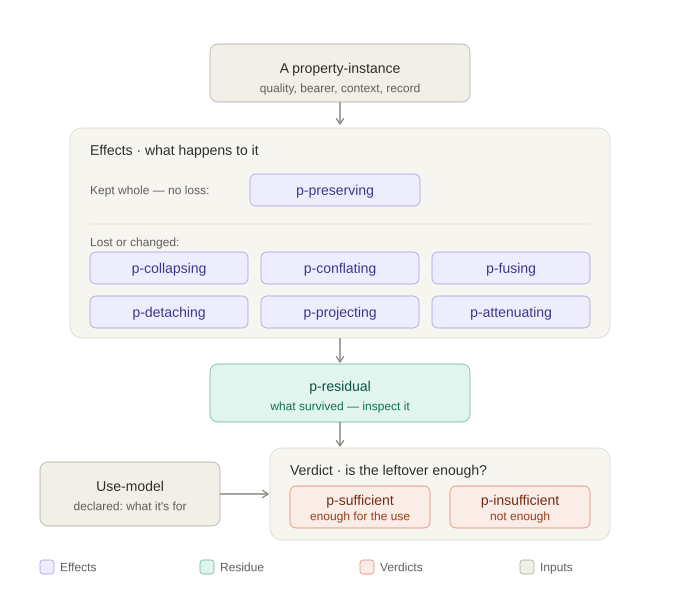

// SPDX-License-Identifier: MPL-2.0
// SPDX-License-Identifier: CC-BY-SA-4.0
// Copyright (c) Jonathan D.A. Jewell <j.d.a.jewell@open.ac.uk>
// SPDX-FileCopyrightText: 2024-2026 Jonathan D.A. Jewell (hyperpolymath)
= Trope Particularity
:toc:
:toc-placement: preamble

image:https://img.shields.io/badge/License-MPL_2.0-blue.svg[License: MPL-2.0,link="https://opensource.org/licenses/MPL-2.0"]
image:https://img.shields.io/badge/status-specification-orange[Status: specification]

A diagnostic vocabulary for *property-instance individuation and loss*. It names —
precisely, with a fixed and deliberately small set of terms — the ways a specific,
situated quality gets flattened as it moves through a system, and whether what
survives is *enough for the use at hand*.

[quote]
____
Duck typing asks whether it quacks. Particularity asks which quack you just
laundered into a boolean.
____

[NOTE]
====
`{{FORGE}}`, `{{OWNER}}`, and `{{REPO}}` are deployment placeholders — set them to
your forge, owner, and repository when you publish. The project's working name is
*Particularity*; rename freely.
====

== What this is

A *workbench*, not a language. The artefact is a vocabulary you think _with_: a
board of named tools you pick up to say what just happened to a property-instance.

A *property-instance* is a quality as borne by _this_ entity, in _this_ context,
under _these_ conditions — the hoarseness of _this_ duck, this morning, on this
pond. Not the universal "hoarseness"; the particular, situated instance of it.

The vocabulary sorts into *three kinds of term*, because they are three different
kinds of thing:

* *Effects* — things that _happen_ to a property-instance (seven terms).
* *Residue* — what is _left_ after an effect (one term).
* *Verdict* — a _judgement_ on whether the residue was enough, always relative to a
  declared *use-model* (two terms).

.The ten terms, by family

The shape of the whole thing in one line:

____
A property-instance undergoes some *p-effect*; relative to its declared
*use-model*, the surviving *residual* is judged *p-sufficient* or *p-insufficient*.
____

== What this is not

Three boundaries keep the project honest:

. *Not "trope safety."* This is not a rival to type safety sold on the same ground.
  That comparison is a losing one, and not the point.
. *Not "type theory cannot express this."* Type theory can encode many such
  structures, and so can trope theory. The claim is narrower: neither, _by itself_,
  supplies the diagnostic vocabulary for property-instance individuation and loss.
. *Not a bag of subtle metadata.* The centre stays fixed: individuated
  property-instances. A term that does not bear on individuation or loss does not
  belong here.

And a practical boundary for when any of this matters at all:

____
Particularity matters when loss, detachment, conflation, or portability of
property-instances affects interpretation, correctness, accountability, or later
use.
____

== The vocabulary

=== Effects — what happens to a property-instance

[cols="1,1,3"]
|===
| Term | Arity | What it is

| `p-preserving`  | one | The baseline: nothing lost. Quality, bearer, context, and an honest record all survive. Every other effect is _preserving minus one part_.
| `p-projecting`  | one | Named parts dropped *on purpose*. You know exactly which coordinates are gone. A reduced view, not a lie — _provided nobody mistakes the projection for the whole_.
| `p-collapsing`  | one | Flattened to a predicate or scalar. The quality survives as a _test_; the individual that bore it is gone. The quack becomes `true`.
| `p-detaching`   | one | The quality severed from its bearer — the quality–bearer bond broken. A trait floating free of whose it was.
| `p-attenuating` | one | Fidelity degraded with no clean structure. Unlike projecting, you have lost an _unknown_ amount.
| `p-conflating`  | two | Two numerically distinct instances asserted to be *the same one*, with no label saying so. Downstream reasons about one where there were two, and is silently wrong.
| `p-fusing`      | two | Two instances deliberately blended into one *labelled* aggregate. Not an error — the plurality survives in the label, so downstream knows not to pull them apart.
|===

The arity column marks a real seam: five effects act on a _single_ instance;
`p-conflating` and `p-fusing` _merge two_. The two-arity pair are twins — the
dishonest and honest versions of the same two-into-one move.

=== Residue — what is left

[cols="1,3"]
|===
| Term | What it is

| `p-residual` | What actually survived an effect. The handle you inspect to decide whether the loss mattered.
|===

=== Verdict — relative to a declared use-model

A verdict is *meaningless on its own*. The same collapse is sufficient for counting
ducks and insufficient for diagnosing one — nothing about the collapse changed,
only the use. So a verdict always names the model it is relative to.

[cols="1,3"]
|===
| Term | What it is

| `use-model`      | The declared statement of what a property-instance is _for_. The thing every verdict is relative to.
| `p-sufficient`   | The surviving residual is *enough* for the declared use. What was lost did not matter _for this purpose_.
| `p-insufficient` | The surviving residual is *not enough* for the declared use. Something needed was lost, and reasoning from the residue will go wrong.
|===

== Background

The vocabulary's centre — qualities as borne by _this_ thing, in context — is the
founding move of *trope theory* (the metaphysics of abstract particulars; D. C.
Williams, Keith Campbell). The mapping is close enough to borrow from:

* a *property-instance* is a _trope_;
* *whose it is* (the bearer) is _compresence_ — on the standard view an object just
  _is_ a bundle of mutually compresent tropes;
* `p-conflating` is exactly the collapse of _exact resemblance_ into _numerical
  identity_ — two tropes can be exactly alike and still be two. Keeping those apart
  is the distinction the whole theory is built on.

What trope theory does _not_ supply is the dynamics of *loss* — collapsing,
attenuating, detaching, and the sufficiency verdict. That layer is this project's
own.

=== Compatibility

A candidate effect is a *compatible* addition to the ontology — not merely a
_consistent_ one — only if:

. it *contradicts nothing* the base asserts;
. its connection to the base is a *writable bridge* (a named relation with stated
  conditions), not a quiet redefinition of the base's terms;
. it requires *no change to the base* (a conservative extension); and
. it does *non-redundant work* on a domain the base does not cover.

`p-conflating` and `p-fusing` pass: they are claims about _records_ (what is
asserted, and whether honestly), not about tropes. The bridge is "a singular record
is faithful only if its referent is in fact one trope" — which touches the ontology
nowhere and does new work the ontology is silent on. Each remaining effect earns
its place by the same test.

== Status

Early. This repository is a *specification* — the vocabulary, its discriminating
tests, and its worked examples. There is no checker yet, and no claim of one.

The intended first computable artefact is a *checker, not a language*: annotate
flows with the p-effect they induce, propagate effects through composition, and
flag `p-insufficient` flows against each consumer's declared use-requirement. Idris2
is the likely home — its quantitative types already track the loss-_plumbing_
(whether a value is dropped), leaving this layer to add _dropped into what, and was
the remainder enough_. A Scheme sketch may come first, to feel out the shape.

== Repository map

[cols="1,3"]
|===
| Path | What lives there

| `README.adoc`          | This file.
| `vocabulary/`          | One entry per term: definition, the test against its neighbour, one worked example.
| `examples/`            | The same situation laundered several ways (the duck, a record, a person).
| `docs/background.adoc` | The trope-theory grounding and the compatibility test, in full.
| `checker/`             | _(planned)_ The drawer-sorter — annotate, propagate, flag.
|===

== Where to go next

* `vocabulary/` — the ten terms, sharpened. Start here.
* `docs/background.adoc` — why the vocabulary is compatible with the metaphysics it
  borrows from.

== Licence

Released under the link:LICENSE[Mozilla Public License 2.0] unless a per-file
`SPDX-License-Identifier` says otherwise.

